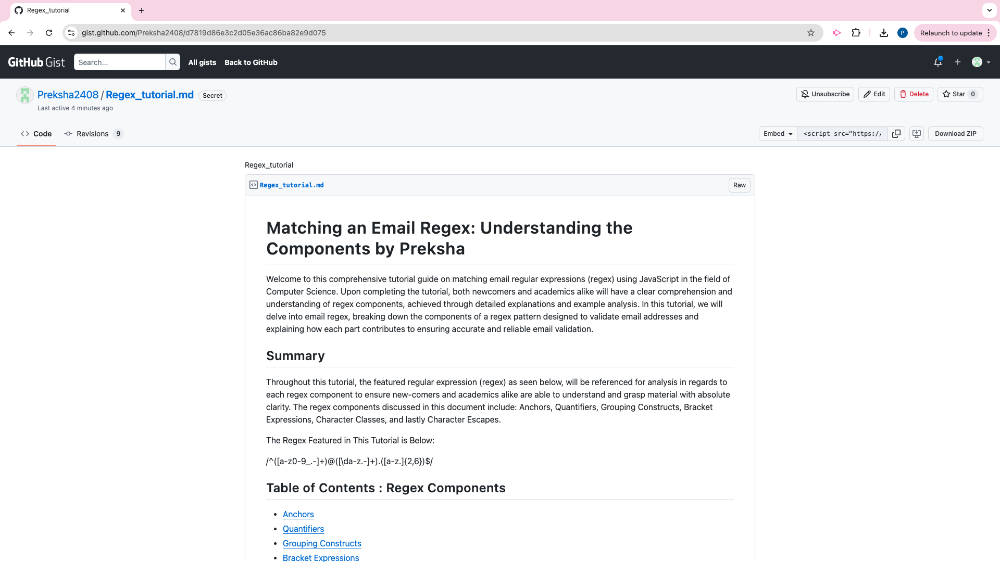

# Preksha-challenge17-regex-tutorial
Created a Regex tutorial : Matching an email regex

## Description

In this Regex Tutorial, you'll learn how to validate email addresses using the featured regular expression (regex): /^([a-z0-9_\.-]+)@([\da-z\.-]+)\.([a-z\.]{2,6})$/. The tutorial offers a detailed breakdown of each component within the regex, making the validation process straightforward and easy to understand. By the end of this tutorial, you'll have a solid understanding of how this regex works to ensure that a given email address is valid.

github gist : [Click here](https://gist.github.com/Preksha2408/d7819d86e3c2d05e36ac86ba82e9d075)

## Table of Contents

* [Description](#description)

* [The challenge](#thechallenge)

* [Usage Instructions](#usage-instructions)

* [Installation](#installation)

* [Screenshots](#screenshots)

* [Demo](#Demo)

* [Questions](#questions)

* [Resources](#resources)

## The challenge

User Story

AS A web development student
I WANT a tutorial explaining a specific regex
SO THAT I can understand the search pattern the regex defines

Acceptance Criteria

GIVEN a regex tutorial
WHEN I open the tutorial
THEN I see a descriptive title and introductory paragraph explaining the purpose of the tutorial, a summary describing the regex featured in the tutorial, a table of contents linking to different sections that break down each component of the regex and explain what it does, and a section about the author with a link to the author’s GitHub profile
WHEN I click on the links in the table of contents
THEN I am taken to the corresponding sections of the tutorial
WHEN I read through each section of the tutorial
THEN I find a detailed explanation of what a specific component of the regex does
WHEN I reach the end of the tutorial
THEN I find a section about the author and a link to the author’s GitHub profile

## Usage-Instructions

1. Access the deployed GitHub Gist link.

2. Read through the introductory paragraph and summary.

3. Navigate through the table of contents to explore the different sections of the tutorial.

4. Read and understand each component of the regex pattern.

5. Apply the knowledge gained from the tutorial in your own projects.

## Installation 

* Set up a GitHub Gist:

1. Sign in to your GitHub account or create one if you haven't already.
2. Visit: https://gist.github.com/ to create a new Gist.
3. In the "Gist description" field, enter a brief description of the challenge, such as "Email Regex Challenge".
4. Add a new file to the Gist by clicking on "Add file" and give it a suitable name, like "email_regex_challenge.md".
5. In your newly created Gist, write a brief explanation of the regex, describing each component and its purpose in the 
   email validation process.
6. Explain how the regex can be modified to accept new requirements, such as uppercase letters or additional special 
   characters in the email address.
7. Share your Gist:

Once you have completed the explanation and modifications to the regex, save your Gist by clicking on "Create public Gist" or "Create secret Gist" as per your preference.
Share the link to your Gist with others to discuss different approaches and understanding of the regex.

## Screenshot 

## Demo

* 

# Questions 

For questions or further information, please contact me:

* Email - [prek.ps37@gmail.com](prek.ps37@gmail.com)

* GitHub - [Preksha2408](https://github.com/Preksha2408/Preksha-challenge17-Regex-tutorial.git)

* github gist : [Click here](https://gist.github.com/Preksha2408/d7819d86e3c2d05e36ac86ba82e9d075)

## Resources 

1. W3Resource. (n.d.). JavaScript: HTML Form - email validation. https://www.w3resource.com/javascript/form/email-validation.php
2. University of Toronto. (n.d.). Teaching dossier. Centre for Teaching Support & Innovation. https://teaching.utoronto.ca/resources/teaching-dossier/
3. Steipe, B. (n.d.). Regular expressions. University of Toronto: ABC: Always Be Coding. http://steipe.biochemistry.utoronto.ca/abc/index.php/Regular_Expressions
4. University of Toronto Libraries. (n.d.). OpenRefine tutorial 3: Regular expressions (Regex) activity https://mdl.library.utoronto.ca/technology/tutorials/openrefine-tutorial-3-regular-expressions-regex-activity
5. University of Toronto. (n.d.). Oral presentations. Advice on Academic Writing. https://advice.writing.utoronto.ca/types-of-writing/oral-presentations/
6. Harvard University. (2022). CS50's Web Programming with Python and JavaScript. https://cs50.harvard.edu/python/2022/weeks/7/

These sources provided valuable information on the construction and usage of regex patterns for email validation, as well as insights into the pedagogical aspects of teaching regex to new coders and other academics. This knowledge was incorporated into the creation of the comprehensive tutorial, which aimed to provide an accessible yet academically rigorous explanation of email validation using regex.